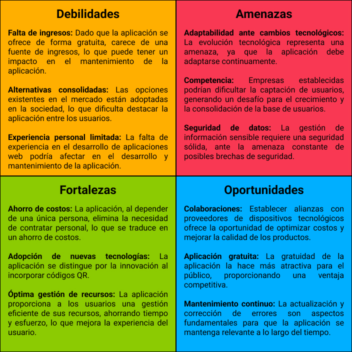
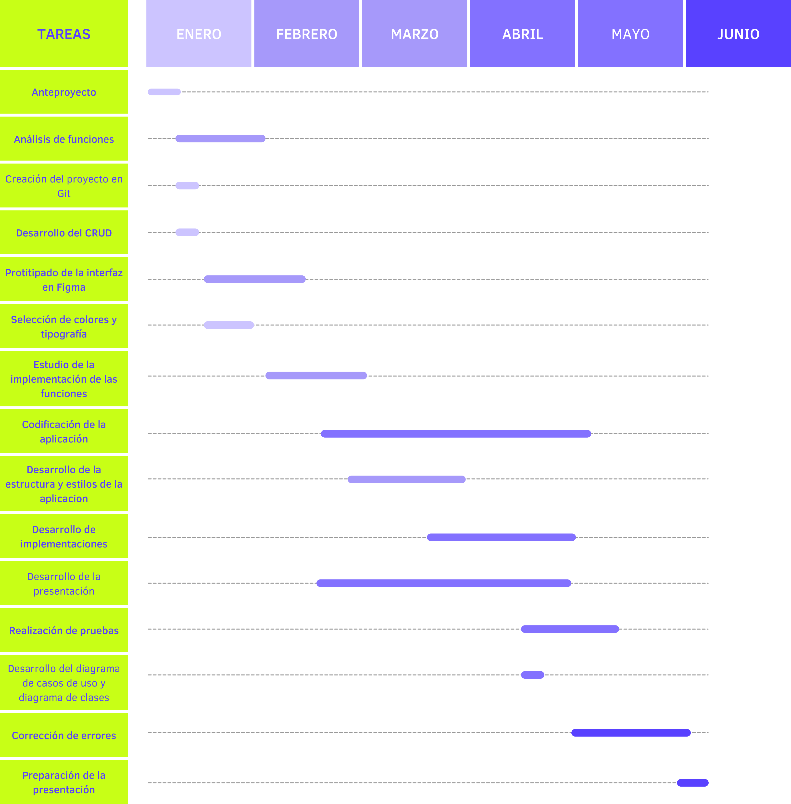

## Presentación del problema planteado

La aplicación tiene como objetivo abordar las necesidades del centro de estudios Ceinmark. En este centro educativo, los estudiantes pueden usar portátiles del centro durante las horas de clase, los cuales incluyen sus respectivos cargadores.

Actualmente, la administración y seguimiento de los portátiles se lleva a cabo mediante una hoja de cálculo Excel. Aunque este método ha cumplido su función hasta ahora, presenta limitaciones, como una visibilidad limitada de la información y el riesgo de pérdida de datos.

Estas limitaciones pueden traducirse en errores, pérdida de información y dificultades en la gestión de los dispositivos, impactando negativamente en la eficacia del alquiler diseñado para beneficiar a los alumnos del centro.

La falta de eficacia podría llevar a considerar la eliminación de esta modalidad, lo cual resultaría desfavorable para los estudiantes.

Para el centro, sería más beneficioso conservar y mejorar este servicio de alquiler, garantizando una gestión más eficaz y evitando posibles decisiones que pudieran perjudicar a los alumnos.

## Objetivos

El objetivo es garantizar un acceso fluido a los dispositivos que el centro de estudios proporciona a sus alumnos, simplificando la gestión y evitando posibles pérdidas de información.

Para lograr este objetivo, se implementarán códigos QR que los profesores escanearán. Al escanear un código QR, se accederá a la información del dispositivo, proporcionando detalles sobre su estado y permitiendo saber al profesor si el portátil está disponible o no.

En la página de inicio, se mostrarán gráficos que brindarán a los usuarios información sobre el estado de los portátiles y cargadores, el uso de dispositivos por ciclo formativo, la capacidad de los almacenes y el historial de uso de los dispositivos a lo largo del tiempo.

Adicionalmente, se proporcionará al usuario administrador un sistema que facilitará la gestión de alumnos, cursos, portátiles, cargadores y almacenes. Este sistema permitirá realizar búsquedas, aplicar filtros y descargar la información en formato PDF. Para agilizar la introducción de datos, el usuario administrador podrá importar archivos CSV, lo que simplificará el proceso y ahorrará tiempo.

## Diagrama DAFO

## Descripción técnica

Para la implementación del proyecto, se emplearán las siguientes tecnologías:

**Lenguajes de programación:**
- MySQL: Sistema de gestión de la base de datos de la aplicación.
- PHP: Lenguaje de programación que trabaja con bases de datos para implementar funciones dinámicas en la aplicación web.

**Lenguajes de marcas:**
- HTML y CSS: Lenguajes para estructurar y estilizar las páginas web.

**Frameworks:**
- Yii2: Framework de PHP en el que se implementara la aplicación web.
- Bootstrap: Framework para configurar la arquitectura y facilitar la implementación de código HTML y CSS.

**Entornos de desarrollo:**
- NetBeans: Entorno de desarrollo
- Visual Studio Code: Entorno de desarrollo
- dbForge Studio: Entorno de desarrollo para gestionar la base de datos

**Otras tecnologías:**
- Git: Sistema de control de versiones para gestionar el desarrollo del proyecto.
- Figma: Herramienta para diseñar la interfaz de usuario.
- Dia: Aplicación para crear diagramas.
- Canva: Plataforma para realizar diseños y presentaciones.
- Notion: Aplicación para gestionar el proyecto y tomar notas.
- PowerPoint: Aplicación para realizar presentaciones.

## Planificación del trabajo

### Estimación temporal

Semana 1 (01/01/2024 → 07/01/2024): Estimación de 7 horas
- Desarrollo del anteproyecto

Semana 2 (08/01/2024 → 14/01/2024): Estimación de 10 horas
- Desarrollo del anteproyecto
- Análisis de funciones
- Creación del proyecto en Git
- Desarrollo del CRUD de la base de datos

Semana 3 (15/01/2024 → 21/01/2024): Estimación de 11 horas
- Análisis de funciones
- Prototipado de la interfaz de Figma
- Selección de colores y tipografía

Semana 4 (22/01/2024 → 28/01/2024): Estimación de 12 horas
- Análisis de funciones
- Prototipado de la interfaz de Figma
- Selección de colores y tipografía

Semana 5 (29/01/2024 → 04/02/2024): Estimación de 12 horas
- Análisis de funciones
- Prototipado de la interfaz de Figma

Semana 6 (05/02/2024 al 11/02/2024): Estimación de 10 horas
- Prototipado de la interfaz de Figma
- Estudio de la implementación de las funciones

Semana 7 (12/02/2024 → 18/02/2024): Estimación de 12 horas
- Prototipado de la interfaz de Figma
- Estudio de la implementación de las funciones

Semana 8 (19/02/2024 → 25/02/2024): Estimación de 11 horas
- Prototipado de la interfaz de Figma
- Estudio de la implementación de las funciones
- Codificación de la aplicación

Semana 9 (26/02/2024 → 03/03/2024): Estimación de 10 horas
- Estudio de la implementación de las funciones
- Codificación de la aplicación
- Desarrollo de la estructura y estilos de la aplicación

Semana 10 (04/03/2024 → 10/03/2024): Estimación de 12 horas
- Codificación de la aplicación
- Desarrollo de la estructura y estilos de la aplicación

Semana 11 (11/03/2024 → 17/03/2024): Estimación de 13 horas
- Codificación de la aplicación
- Desarrollo de la estructura y estilos de la aplicación

Semana 12 (18/03/2024 → 24/03/2024): Estimación de 10 horas
- Codificación de la aplicación
- Desarrollo de la estructura y estilos de la aplicación
- Desarrollo de implementaciones

Semana 13 (25/03/2024 → 31/03/2024): Estimación de 11 horas
- Codificación de la aplicación
- Desarrollo de la estructura y estilos de la aplicación
- Desarrollo de implementaciones

Semana 14 (01/04/2024 → 07/04/2024): Estimación de 11 horas
- Codificación de la aplicación
- Desarrollo de implementaciones
- Desarrollo de la presentación

Semana 15 (08/04/2024 → 14/04/2024): Estimación de 11 horas
- Codificación de la aplicación
- Desarrollo de implementaciones
- Desarrollo de la presentación

Semana 16 (15/04/2024 → 21/04/2024): Estimación de 12 horas
- Codificación de la aplicación
- Desarrollo de implementaciones
- Desarrollo de la presentación
- Realización de pruebas
- Desarrollo del diagrama de casos de uso y diagrama de clases

Semana 17 (22/04/2024 → 28/04/2024): Estimación de 11 horas
- Codificación de la aplicación
- Desarrollo de implementaciones
- Desarrollo de la presentación
- Realización de pruebas

Semana 18 (29/04/2024 → 05/05/2024): Estimación de 13 horas
- Codificación de la aplicación
- Desarrollo de la presentación
- Realización de pruebas
- Corrección de errores

Semana 19 (06/05/2024 → 12/05/2024): Estimación de 11 horas
- Desarrollo de la presentación
- Realización de pruebas
- Corrección de errores

Semana 20 (13/05/2024 → 19/05/2024): Estimación de 10 horas
- Desarrollo de la presentación
- Corrección de errores

Semana 21 (20/05/2024 → 26/05/2024): Estimación de 10 horas
- Desarrollo de la presentación
- Corrección de errores

Semana 22 (27/05/2024 → 02/06/2024): Estimación de 9 horas
- Desarrollo de la presentación
- Corrección de errores
- Preparación de la presentación

Semana 23 (03/06/2024 → 07/06/2024): Estimación de 7 horas
- Preparación de la presentación

### Diagrama de Gantt

## Descripción de la documentación a entregar

A continuación, se presentan los documentos que serán entregados:
- Productos de la planificación: Anteproyecto
- Productos del análisis: Diagrama Entidad-Relación y diagrama de casos de uso.
- Productos del diseño: Prototipo de la interfaz, diagrama de clases, diagrama relacional, documento del color y tipografía.
- Productos de la implementación: Documentación del código.
- Productos de las pruebas. Pruebas realizadas y resultados obtenidos.
- Memoria del proyecto: Diario de trabajo (tareas realizadas, dificultades encontradas, cambios, problemas y soluciones aportadas).

## Bibliografía

28/12/2023 Desarrollo de la portada, encabezado y los diferentes puntos del anteproyecto.
29/12/2023 Desarrollo de la presentación del problema planteado.
30/12/2023 Desarrollo del DAFO y de la descripción de la documentación a entregar.
31/12/2023 Desarrollo de la descripción técnica.
04/01/2024 Desarrollo de los objetivos.
05/01/2024 Desarrollo del diagrama de Gantt.
07/01/2024 Desarrollo de la planificación del trabajo y la estimación temporal.
08/01/2024 Implementación del DAFO, corrección de la descripción técnica, mejora de los objetivos y de la planificación del trabajo.
09/01/2024 Mejora del diagrama de Gantt y corrección de la planificación del trabajo.
